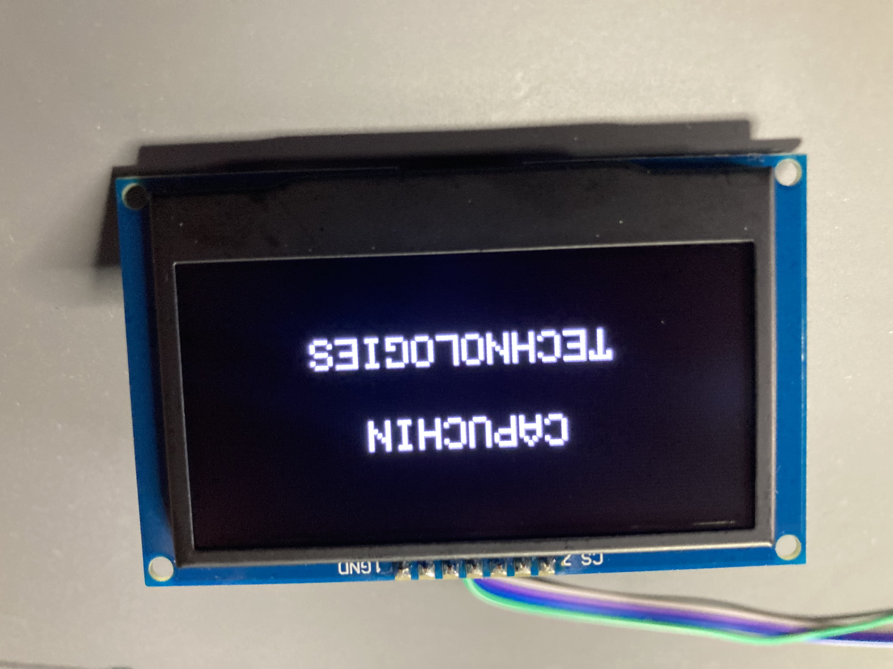
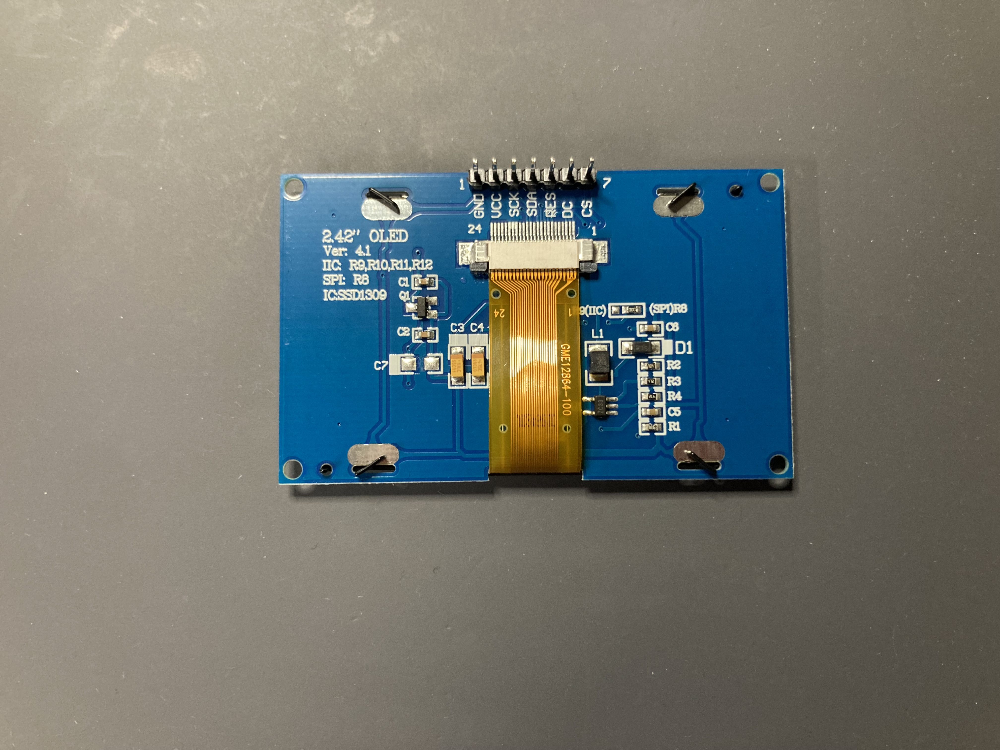
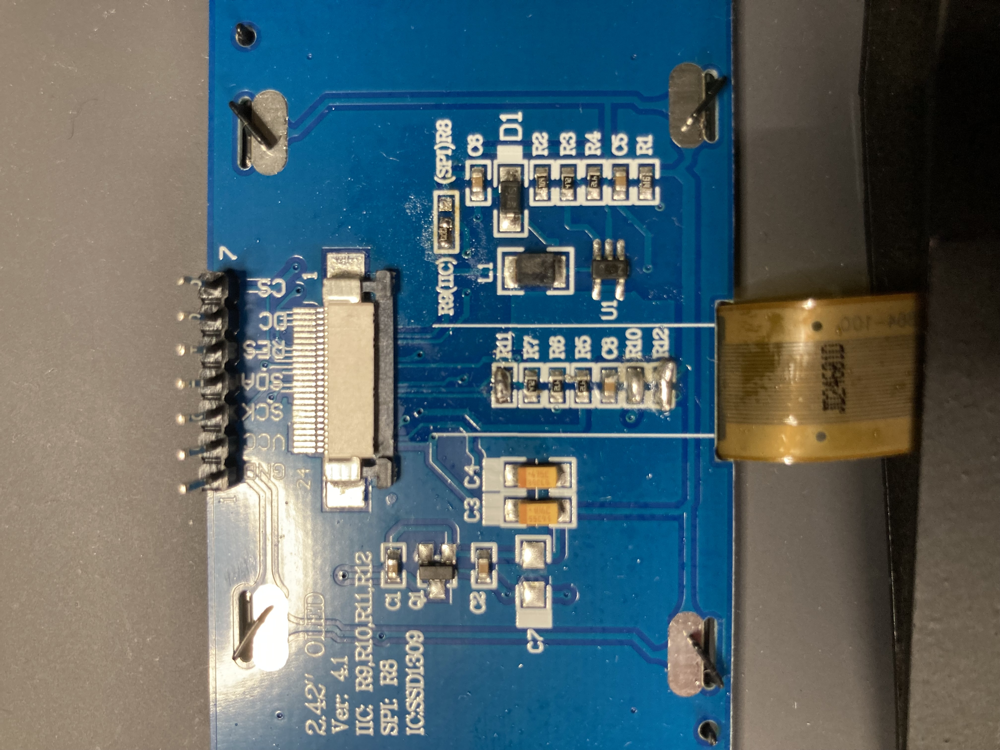
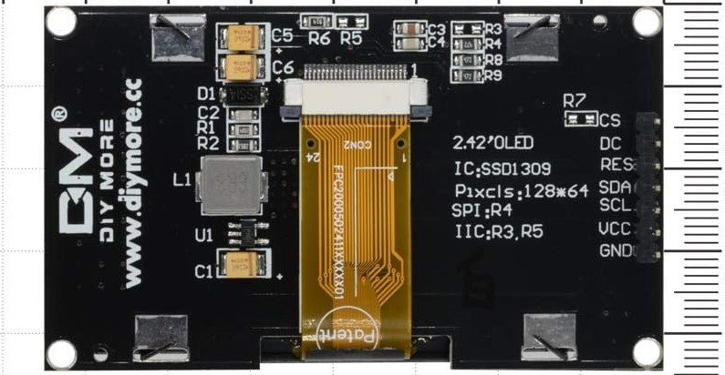
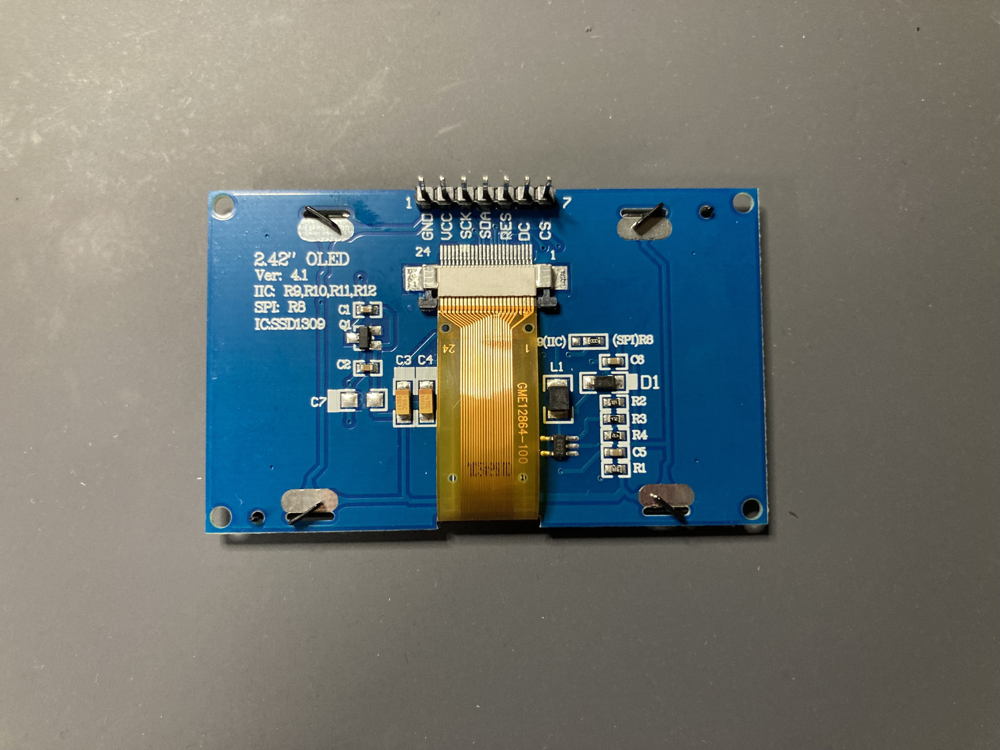
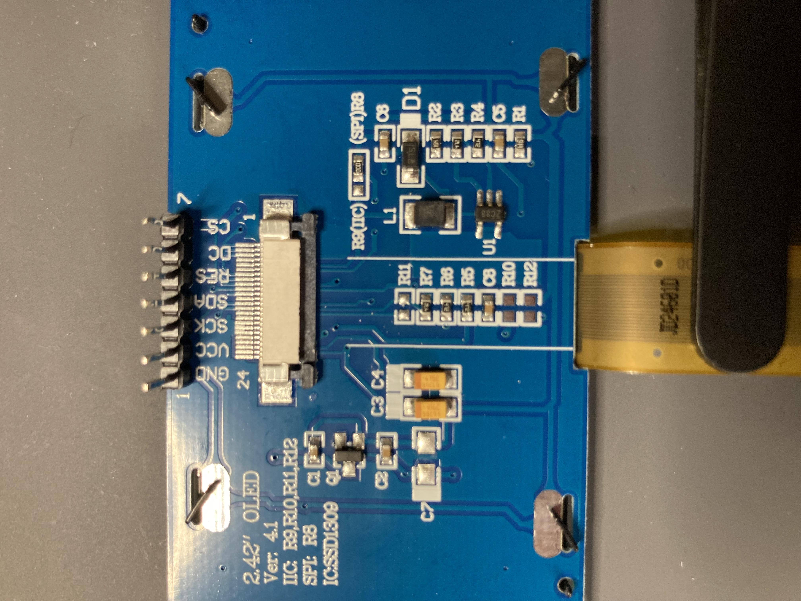

## Introduction

The vast majority of OLED 2.42" display modules are designed to be able to use two different communication protocols: SPI and I2C. However, these modules out-the-box are configured for SPI, and need some adjustment to work with I2C. However, how to complete these adjustments are not very well documented online. 

This tutorial will guide you through configuring the most common type of 2.42" OLED display modules for I2C communication.

### Learning Objectives

- Configuring OLED 2.42" display module from SPI communication to I2C communication
- Display text on the OLED 2.42" display module

### Background Information

A 2.42" OLED display module is a device that can be easily connected to a microcontroller, such as the ESP32, to display text and graphics. These modules communicate with the microcontroller through one of two communication modules: SPI (Serial Protocol Interface) and I2C (Inter-Integrated Circuit). 
These communication protocols have many differences; however, in this tutorial, the difference we care about is the amount of wires needed to connect to the module. The SPI configuration requires 4 wires (MISO, MOSI, SCL, and SS), while I2C requires only 2 wires (SCL and SDA).
However, the majority of 2.42" OLED display modules arrive out-of-the-box configured for SPI communication, and require some hands-on-reworking to configure them for I2C. 

## Getting Started

### Required Downloads and Installations

This tutorial utilizes the Arduino IDE to communicate with the ESP32 devkit. This can be downloaded from the Arduino website [here](https://www.arduino.cc/en/software).

The following Arduino library packages need to be installed as well:
- Adafruit SSD1306
- Adafruit GFX Library
These packages can be installed within the Arduino IDE by going to `Sketch` -> `Include Library` -> `Manage Libraries...`. This will open a search bar, in which you can search for and install these packages. 

The following board needs to be installed:
- esp32

This board can be installed within the Arduino IDE by going to `Tools` -> `Board` -> `Boards Manager...`. This will open a search bar, in which you can search for and install this board.

### Required Components


| Component Name | Quanitity |
| -------------- | --------- |
| ESP32          | 1         |
| 2.42" OLED     | 1         |
| Solder         | Some      |
| Jumper Wires   | 4         |


### Required Tools and Equipment

-Soldering Iron
-Soldering Wick
-Computer
-USB Cable to connect ESP32 to OLED


## Part 01: What Components to Change

### Introduction

This is an introduction to two common types of PCBs for the 2.42" OLED Display Module, and the components that need to be adjusted. 
### Objective

- Recognize two common types of PCB designs for the 2.42" OLED Display Module
- Identify which components to adjust

### Background Information

No additional skills necessary

### Components

- 2.42" OLED Display Module
  
### Instructional

There are two common PCB designs for the 2.42" OLED display module that are commonly used. Both designs will typically label which components need to be adjusted on the silkscreen of the board. We will identify these components in this section.


*Figure 2*

*Figure 3*

The first design, pictured in Figure 2, is the more common and readily available design online. This version requires 4 resistors to be adjusted; in the example module pictured in Figure 2, the resistors that we need to adjust are: R9, R10, R11, and R12. Some of these resistors are hidden behind the display ribbon cable, and require this cable to be disconnected (see Figure 3). We will discuss how to disconnect this cable later in the tutorial.
For R9, the resistor on R8 must be desoldered and moved to R9. The other resistor pads can simply be shorted with a bit of solder or a wire.

We will focus on this design for the remaining steps of our tutorial. 



*Figure 4*
The second design, pictured in Figure 4, is a rarer design that can be found online. This version requires just two resistors to be adjusted and does not need the cable to be removed. The components that need to be adjusted in this example are: R3 and R5. 
For R3, the resistor on R4 must be desoldered and moved to R3. The other resistor pads can simply be shorted with a bit of solder or a wire.


## Part 02: Soldering 

Step-by-step on how to solder your adjustments needed for I2C communication. 
This section will focus on the first design introduced in Part 1. 

### Background Information

-Soldering and desoldering skills required
This tutorial also utilizes the resistor labels on the 2.42" OLED Display Module we have pictured. Your labels may be different; be sure to double-check! How to find which resistors to adjust can be found in Part 1. 

### Components

- 2.42" OLED Display Module
  
### Instructional

## Step 1: Disconnect the bracket holding the display cable.

Gently pull back on the black tab holding the display cable to its white connector until you hear a click. Once it clicks, you will be able to disconnect the display cable and safely adjust the resistor pads below. 


*Disconnecting the bracket on Design A*

## Step 2: Desolder R8 and Soldering R9
Using your soldering iron and solder wick, gently desolder the resistor at R8 off of the board. This resistor will need to be then soldered to R9. 

Warning! Be careful when heating the solder pads of the OLED module. When using too much heat, these pads can easily be melted or ripped off of the board. 

## Step 3: Soldering R10, R11, and R12
These pads do not need a specific resistor to be soldered to them and can be simply shorted across. For one set of resistor pads, use your soldering iron and some solder to create a connection between them. Repeat this for each resistor pad set. 

When you are done, your result should look like the example in Figure 7. 

*Figure 7*

## Step 4: Reconnect the Display Cable
With everything soldered, it is time to reassemble the board. Simply reconnect the display cable to its connector, and push the black bracket back into place until you hear a click. 

With this, you have successfully reconfigured your 2.42" OLED module for I2C communication! 


## Part 03: Coding your OLED Module

### Introduction

This is a quick introduction to coding your OLED module using the Arduino IDE and an ESP32. 


### Background Information

-Arduino Coding necessary

### Components

- 2.42" OLED Display Module
- ESP32
- Computer
- USB cable
  
### Instructional
## Step 1: Connecting the OLED module to the ESP32
Now that your module is successfully set up in I2C mode, it can now be connected to your ESP32 via 4 pins: VCC, GND, SDA, and SCL. 
These pins should connect from your OLED to your ESP32 as follows:
VCC -> 3V3
GND -> GND
SDA -> GPIO21
SCL -> GPIO22

Your ESP32 can now be connected to your computer, and your 2.42" OLED display module is now ready to be coded! 

### Example

## Introduction
Now that our esp32 is connected to the OLED, here is a small program to display some text. 

## Code:
```
#include <SPI.h>
#include <Wire.h>
#include <Adafruit_GFX.h>
#include <Adafruit_SSD1306.h>

#define SCREEN_WIDTH 128 // OLED display width, in pixels
#define SCREEN_HEIGHT 64 // OLED display height, in pixels

#define OLED_RESET     -1 // Reset pin # (or -1 if sharing Arduino reset pin)
#define SCREEN_ADDRESS 0x3C ///< See datasheet for Address; 0x3D for 128x64, 0x3C for 128x32
Adafruit_SSD1306 display(SCREEN_WIDTH, SCREEN_HEIGHT, &Wire, OLED_RESET);

void setup() {
  Serial.begin(9600);
  display.begin(SSD1306_SWITCHCAPVCC, SCREEN_ADDRESS);
  display.setTextColor(SSD1306_WHITE);
 
  display.clearDisplay();
  delay(2000);
  display.print("Hello ECE 196!");
  display.display();
}

void loop(){

}
```

This code should display the message `Hello ECE 196` on your OLED screen. If it does not, double check what I2C address your device has. This can be done utilizing an I2C scanner. We recommend using the script provided [here](https://randomnerdtutorials.com/esp32-i2c-scanner-arduino/).

### Analysis

In this tutorial, we have  walked through the steps on how to configure an off-the-shelf 2.42" OLED display module for I2C communication. This is exactly what we did in our [ELOAD](https://sites.google.com/ucsd.edu/capuchin-technologies/home?authuser=0) project to display our front panel UI. 

## Additional Resources

### Useful links

[I2C Scanner Tutorial](https://randomnerdtutorials.com/esp32-i2c-scanner-arduino/)
